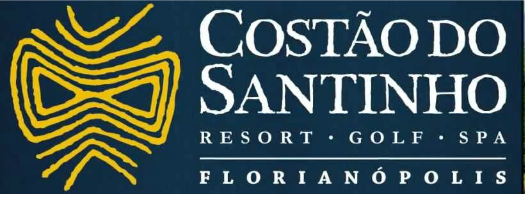
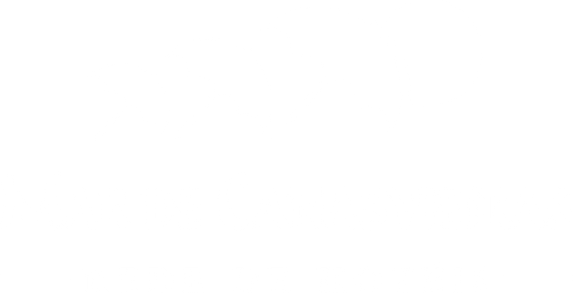
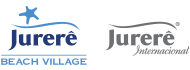
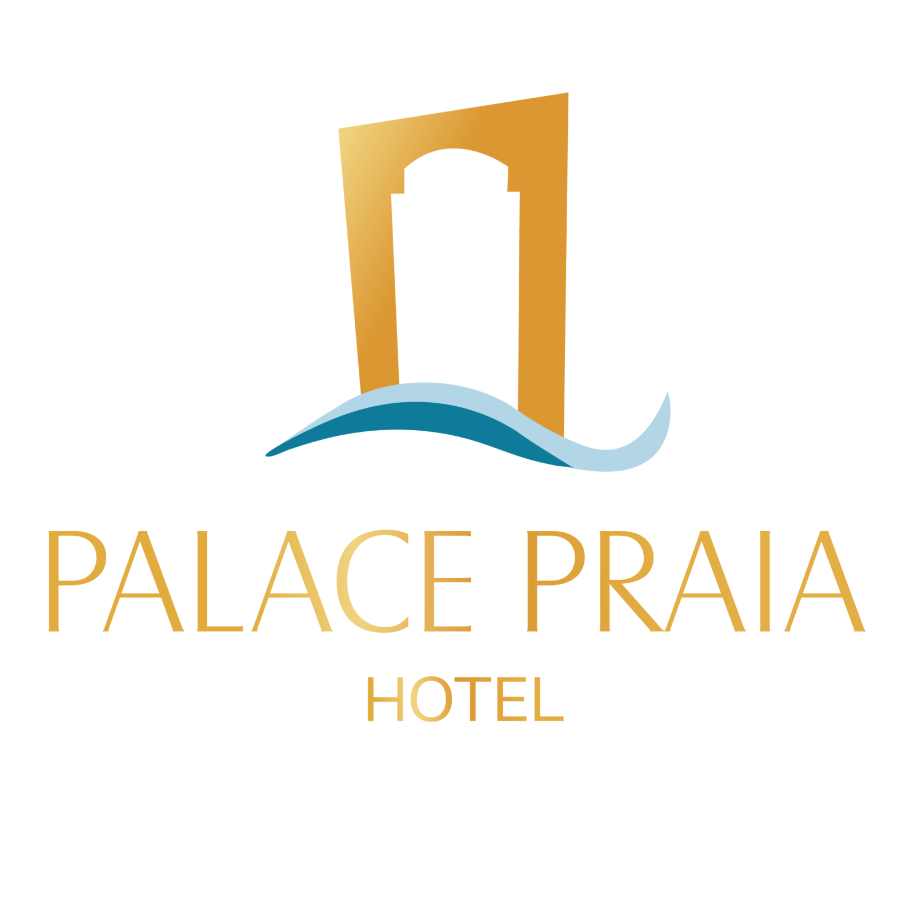
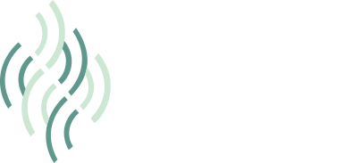
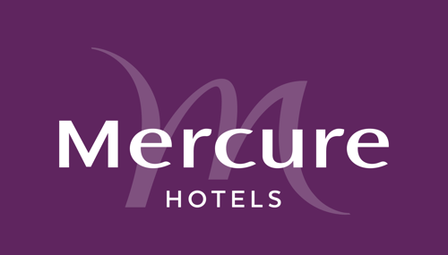
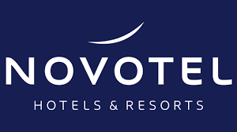
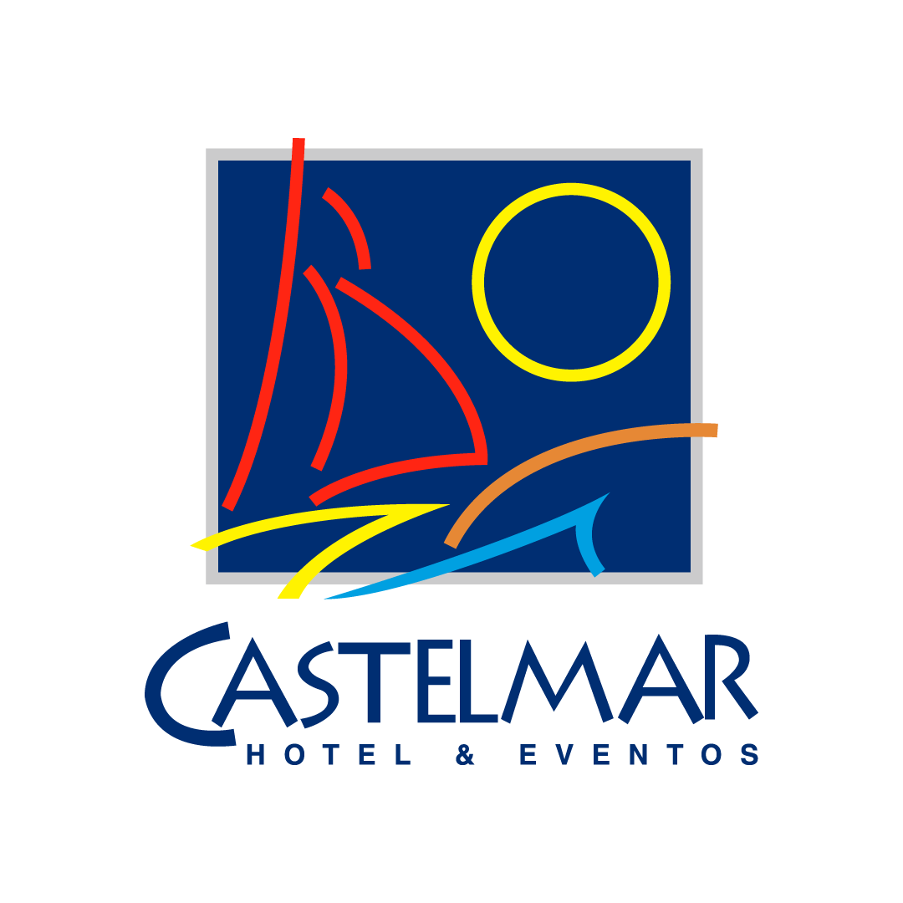

INFORMAR O CÓDIGO **COP2021** PARA DESCONTOS DE 5% A 15%

---

## Costão do Santinho
<carousel slides='costao-santinho-01.jpg,costao-santinho-02.webp,costao-santinho-03.jpg,costao-santinho-04.jpg'></carousel>
- 📍 Praia do Santinho
- https://costao.com.br/
- **\$\$\$\$**

***

- 
## Mar de Canasvieiras
<carousel slides='mar-canasvieiras-01.jpg,mar-canasvieiras-02.jpg,mar-canasvieiras-03.jpg'></carousel>
- 📍 Canasvieiras
- https://www.redemardecanasvieiras.com.br/
- **\$\$**\$\$

---

- 
## Il Campanario
<carousel slides='il-campanario-01.jpg,il-campanario-02.jpg,il-campanario-03.jpg'></carousel>
- 📍 Jurerê Internacional (15 mins do evento)
- http://www.ilcampanario.com.
- **\$\$\$\$**

---

- 
## Beach Village
<carousel slides='jurere-01.jpg,jurere-02.jpg,jurere-03.jpg,jurere-04.jpg'></carousel>
- 📍 Jurerê Internacional (15 mins do evento)
- https://www.jurerebeachvillage.com.br
- **\$\$\$**\$

---

---

- 
## Palace Praia Hotel
- 📍 Canasvieiras
- http://www.palacepraia.com.br
- **\$\$\$**\$

---

- 
- ## Hotel Torres da Cachoeira
- 📍 Cachoeira do Bom Jesus ( 10 min do evento)
- https://www.hoteltorresdacachoeira.com
- **\$\$\$**\$

---

- 
- ## Mercure
- 📍 Itacurubi (25 mins do evento)
- 48 3231-1703 / h5693-re@accor.com.br
- **\$\$**\$\$\$

---

- 
- ## Slavieiro
- 📍 Ingleses ( 20 mins do evento)
- https://www.slavierohoteis.com.br
- **\$\$\$\$**

---

- 
- ## Novotel
- 📍 Beira Mar- Centro (40 mins do evento)
- h5947-re1@accor.com / 48 3202-61
- **\$\$\$**\$

---

- 
- ## Castelmar
- 📍 Centro (45 mins do evento)
- reservas@castelmarhotel.com.br / (48) 3952.3218
- **\$\$**\$\$\$

---

- 
- ## Maria do Mar
- 📍 João Paulo (20 mins do evento)
- http://www.mariadomar.com.br
- **\$\$**\$\$\$

---
